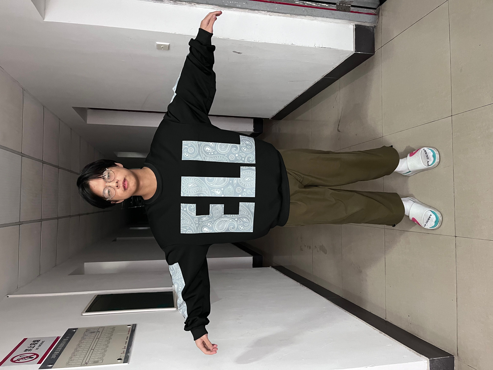
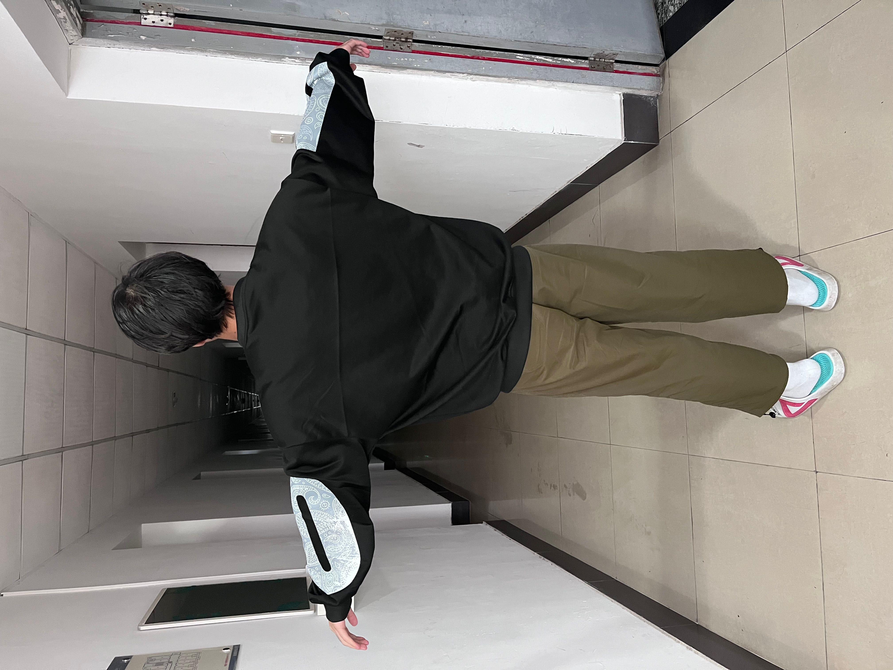

# textured-novel-pose-rendering
🕺🕺🕺🕺🕺🕺🕺🕺🕺🕺🕺🕺🕺🕺🕺🕺🕺🕺🕺🕺🕺🕺
1. Stand still, take a photo from your front side, take a photo from your back side.
2. Prepare you favourite dance video, split it to frames, and save into the `images` folder

Then you can get the `motion_video.mp4`, you are dancing~

<center class = "half">
	
    
</center>


This project is built on the great and useful projects: [textured_smplx](https://github.com/qzane/textured_smplx), [romp](https://github.com/Arthur151/ROMP), [smplify-x](https://github.com/vchoutas/smplify-x), [humannerf](https://github.com/chungyiweng/humannerf)

> Since the complex dependence, basically you can refer to [textured_smplx](https://github.com/qzane/textured_smplx) and [romp](https://github.com/Arthur151/ROMP)

> choose one way to run the code:
>
> 1. run pipeline directly
> 2. run step by step

## Pipeline

```bash
python pipeline.py data/obj1 data/obj1/images/P01125-150055.jpg data/obj1/images/P01125-150146.jpg 
```


## Run pipeline by steps

### step0: prepare motion sequences

```bash
# prepare a folder of frames in images/, if you have the video, try ffmpeg or use romp deal with video directly.
romp --mode=video --calc_smpl --render_mesh -i=images/ -o=romp_output/ -t -sc=1. 
```

Then get npz with SMPL params sequences.

### step1: prepare your image data

example can be find in `./data/obj1/images`

### step2: openpose pose detection

```bash
openpose.bin --display 0 --render_pose 1 --image_dir ./data/obj1/images --write_json ./data/obj1/keypoints --write_images ./data/obj1/pose_images --hand --face
```

### step3: fit smpl/smplx model

Please follow the instruction [here](https://github.com/vchoutas/smplify-x)

```bash
python smplifyx/main.py --config cfg_files/fit_smpl.yaml --data_folder ../data/obj1 --output_folder ../data/obj1/smpl  --model_folder models --vposer_ckpt V02_05
```

`data_folder` should contain `images` folder and `keypoints` folder in `../data/obj1`, and the output contain fitted `obj` and `pkl` (SMPL param relative)

### step4: texture generation

run `python demo.py data_path front_img back_img smplx`


### step5: render

run `python prepare_smpl_sequences` to get images of novel pose
save the images in `motion_snapshots` folder

### step6: images to video

run `ffmpeg`, for example:

```bash
ffmpeg -f image2 -i motion_snapshots/%06d.png motion_video.mp4
```

